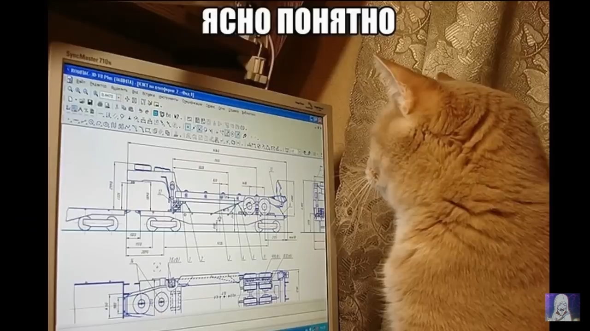

# Здравствуй читатель.
> Меня зовут Падаван Обиванович.
> Моя специализация `Сетевой инженер`.

	

## Произвожу обслуживание инфраструктуры ШПД:
 1. Т.О. таких уровней как:
	- _Доступа_
	- _Агрегации_
	- _Ядра_
 2. Ведение документации и схем.
 3. Проведение **мониторинга** сети, ее диагностики и устранения *аварийных* ситуаций.
 4. Много чего еще, но об этом узнаете на собесе.
